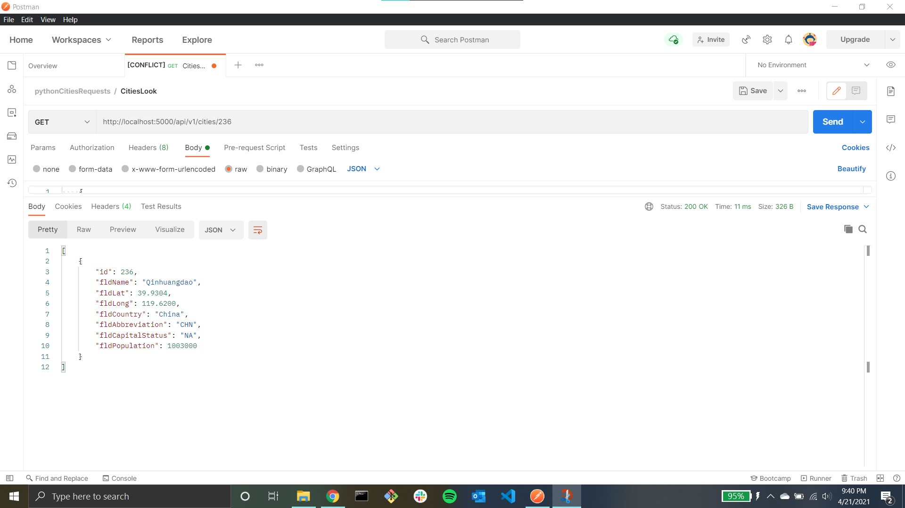
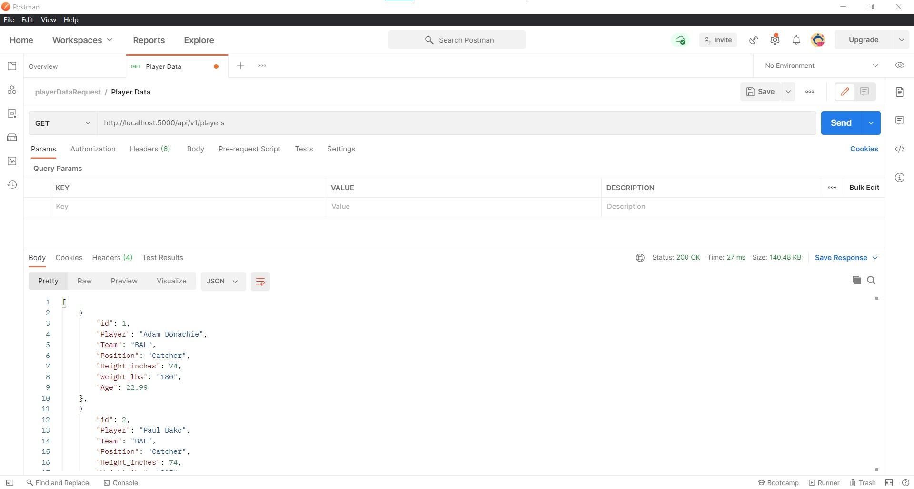
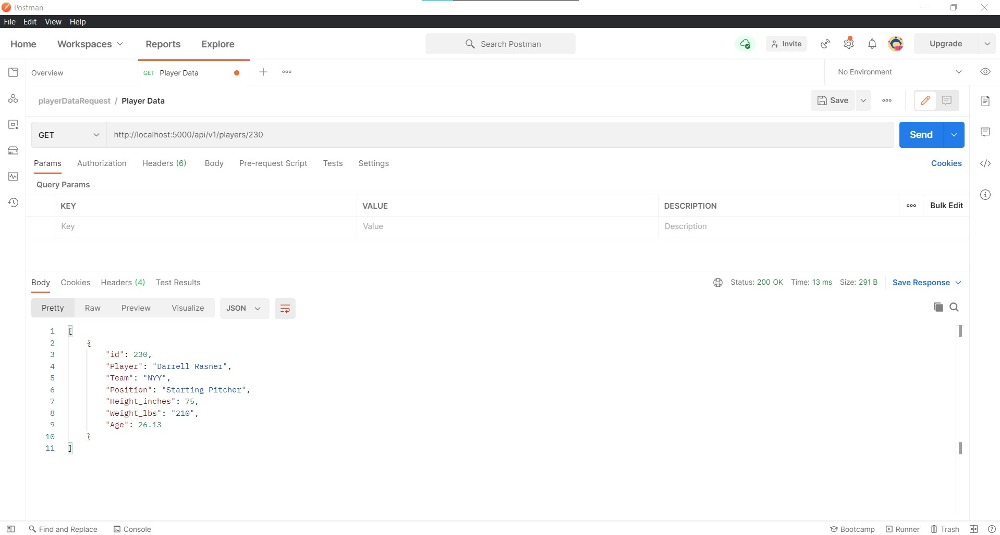
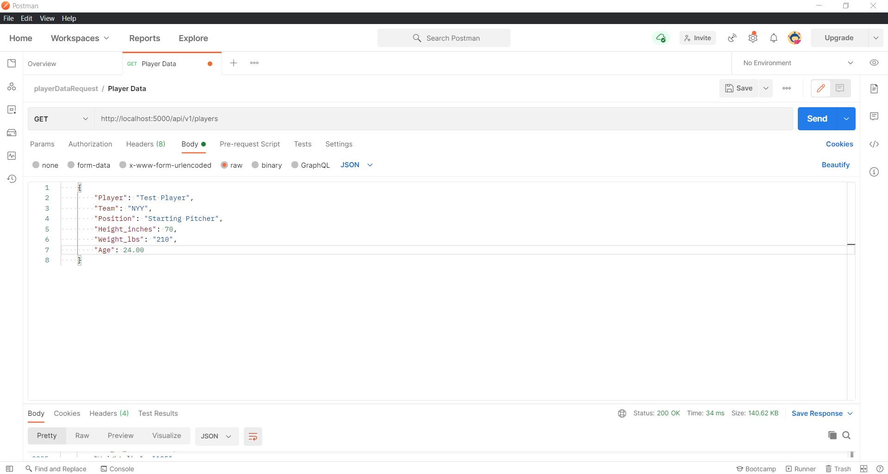
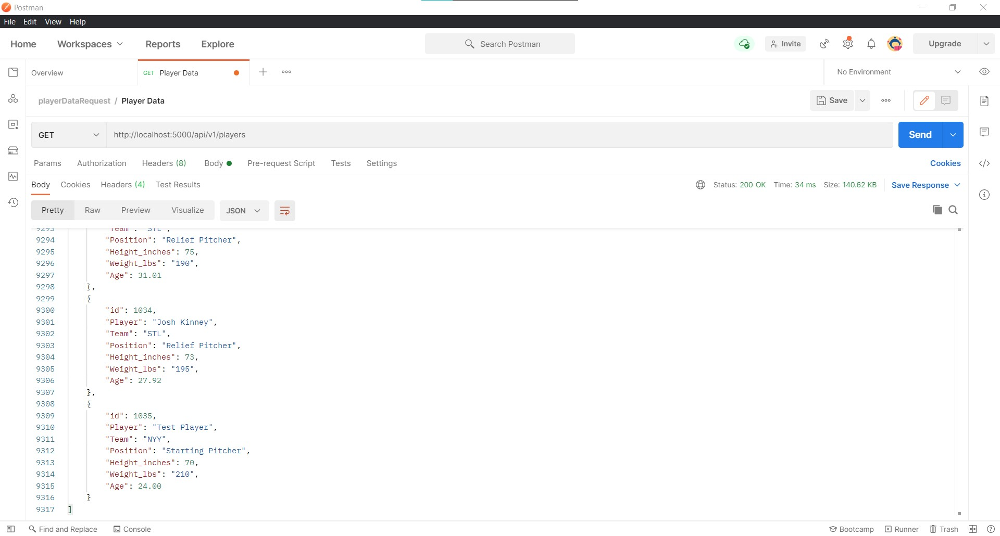
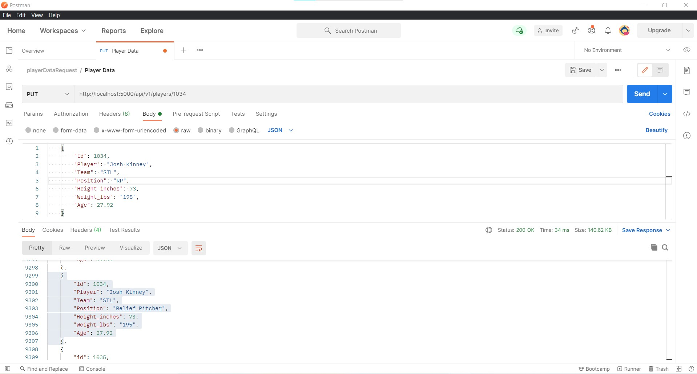
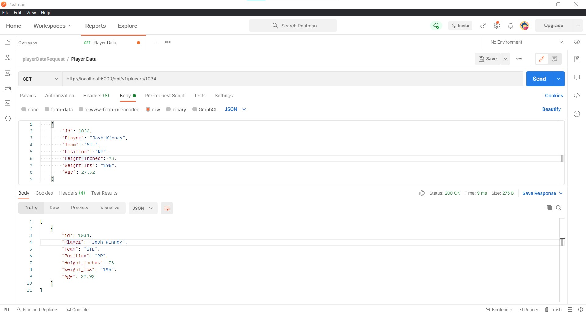
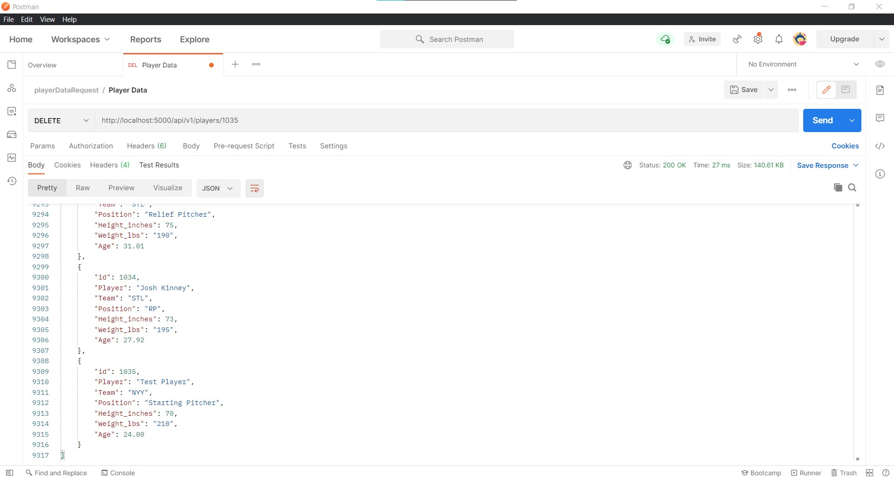
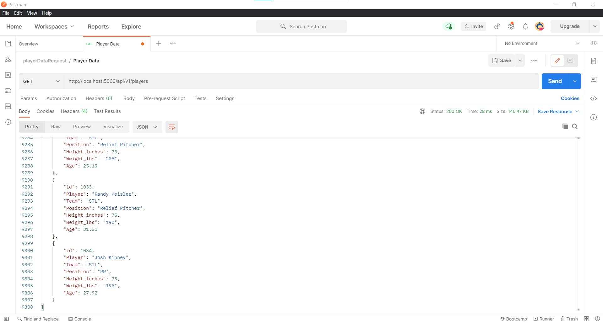
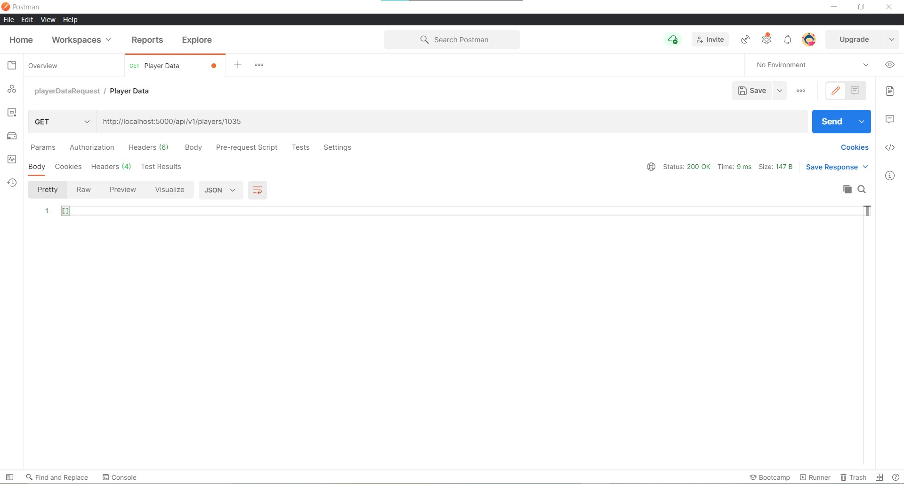

# IS601-FinalProj-Indv
The README is split into two parts: city data and mlb players data.

## City Data

### GET Request

### GET Request (Specific city)

### POST Request

POST request is inserting the city of "Princeton", and is at the end of the JSON file.

### POST Request (Confirmation)

### PUT Request

Changed "Italy" to "Italia"

### PUT Request (Confirmation)

### DELETE Request

Deleted city "Louisville".

### DELETE Request (Confirmation)

## MLB Players Data

### GET Request

### GET Request (Specific player)

### POST Request

POST request is inserting the city of "Princeton", and is at the end of the JSON file.

### POST Request (Confirmation)

### PUT Request

Changed "Relief Pitcher" to "RP"

### PUT Request (Confirmation)

### DELETE Request

Deleted newly created "Test Player"

### DELETE Request (Confirmation)

### DELETE Request (Confirmation 2)

Performed GET request on id to double-check it was deleted
